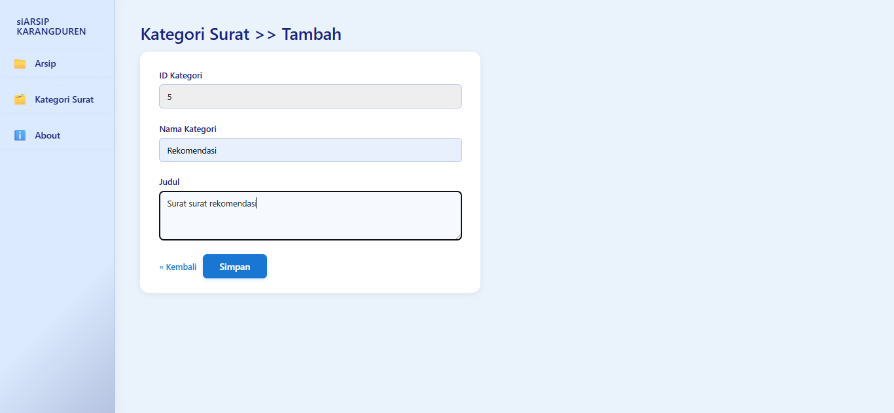

# siARSIP Karangduren

Sistem Arsip Surat Digital untuk Desa Karangduren, Kecamatan Pakisaji. Aplikasi ini membantu perangkat desa mengarsipkan, mencari, dan mengunduh surat-surat resmi secara mudah dan aman.

---

## Tujuan
Menyediakan solusi digital untuk pengarsipan surat resmi di Desa Karangduren. Surat yang diterbitkan akan dipindai dalam format PDF, diunggah ke sistem, dan dapat dicari serta diunduh kembali kapan saja.

## Fitur Utama
- Upload surat resmi (PDF)
- Pencarian surat berdasarkan judul
- Download surat yang sudah diarsipkan
- Kategori surat
- Manajemen surat & kategori (tambah, edit, hapus)
- Otomatis rename file sesuai judul surat
- Tampilan modern & responsif

---

## Cara Menjalankan
Clone repository:
```bash
git clone https://github.com/syarifat/siARSIP-Karangduren.git
```

Masuk ke folder project:
```bash
cd siARSIP-Karangduren
```

Install dependency PHP:
```bash
composer update
```

Install dependency frontend:
```bash
npm install
```

Buat tabel session:
```bash
php artisan session:table
```


Migrasi database:
```bash
php artisan migrate
```

Atau, Anda juga bisa langsung mengimport struktur dan data database menggunakan file SQL berikut:

[Download siarsip_karangduren.sql](siarsip_karangduren.sql)

> **Catatan:**
> Anda bebas memilih menggunakan migrasi Laravel (`php artisan migrate`) atau import file SQL di atas sesuai kebutuhan. Jika menggunakan SQL, pastikan database sudah dibuat dan file diimport melalui phpMyAdmin atau command line.

Buat link storage:
```bash
php artisan storage:link
```

Generate app key:
```bash
php artisan key:generate
```

Jalankan server Laravel:
```bash
php artisan serve
```

Jalankan frontend (Vite):
```bash
npm run dev
```
---

## Screenshot Halaman

Berikut beberapa tampilan utama aplikasi siARSIP Karangduren:

1. **Halaman Utama Arsip Surat**
   
	

2. **Form Unggah File Surat**
   
	

3. **Preview Dokumen Surat (PDF)**
   
	

4. **Edit Dokumen Surat**
   
	

5. **Hapus Dokumen Surat (Modal Konfirmasi)**
   
	

6. **Halaman Utama Kategori Surat**
   
	

7. **Tambah Kategori Surat**
   
	

8. **Edit Kategori Surat**
   
	

9. **Hapus Kategori Surat (Modal Konfirmasi)**
   
	


10. **Halaman About (Portofolio Pembuat)**
   
	
